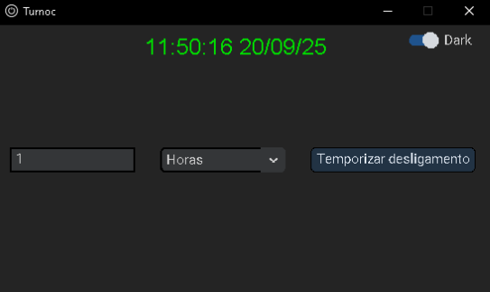
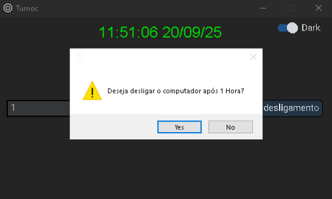
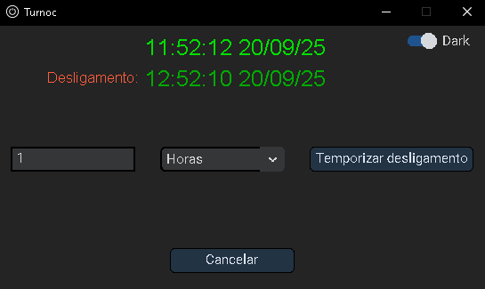
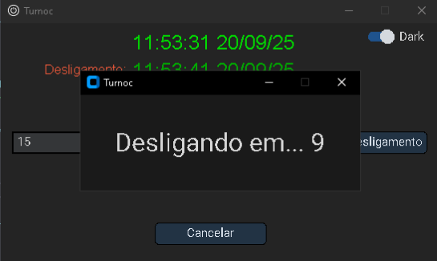

### Turnoc
* Turn off the computer at a set time


## Instructions

### Steps
* Have python installed on your machine - [Site Oficial Python](https://www.python.org/downloads/)
* After installing Python, create a virtual environment and install dependencies and run the program
```bash
py -m pip install -r requirements.txt

py Turnoc.py
```

---
# Português (pt-BR)

### Turnoc
* Desligue o computador com um tempo determinado

## Instruções

### Passos
* Tenha o Python instalado em sua máquina - [Site Oficial do Python](https://www.python.org/downloads/)
* Após instalar o Python, crie um ambiente virtual, instale as dependências e execute o programa
```bash
py -m pip install -r requirements.txt

py Turnoc.py
```

## Interface




